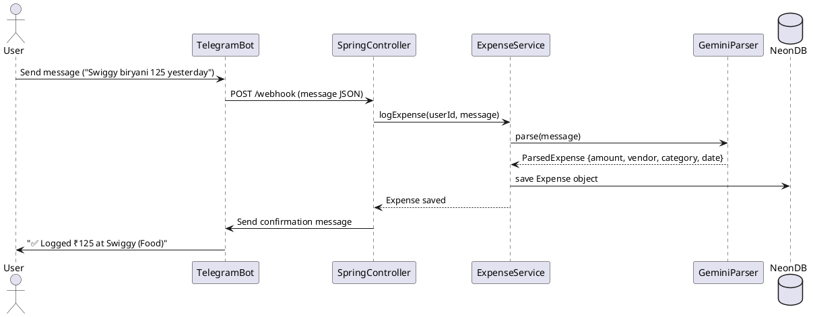

# Household Expense Tracker Bot — Functional & Technical Specification

## Functional Description

**Purpose:**
A lightweight AI-powered expense tracker for personal/home use, integrated via Telegram. It allows users to log daily expenses naturally via chat messages. The system parses messages with AI, extracts structured data, saves it to a database, and responds with a confirmation message.

**Key Features:**

1. **Telegram Bot Interface**
   - Users send natural language expense messages, e.g., `Swiggy biryani 125 yesterday`.
   - No separate UI is required.

2. **AI Parsing**
   - Google Gemini (GenAI) parses messages to structured JSON:
     - amount
     - currency
     - vendor
     - category
     - date
   - Handles messy or varied user input.

3. **Persistence**
   - Expenses are saved in a cloud PostgreSQL database (Neon) with fields:
     - Telegram user ID
     - Amount, currency, vendor, category, date
     - Creation timestamp

4. **Confirmation**
   - Bot replies with structured confirmation:  
     `✅ Logged ₹125 at Swiggy (Food)`

5. **Resilience**
   - If AI fails, raw message is still saved with default values.
   - Retry storms are disabled to prevent repeated failures.

6. **Target Users:** 3–5 household members.

---

## Technical Description

**Stack:**

| Layer | Technology | Role |
|-------|------------|------|
| Bot Interface | Telegram Bot | Chat interface for users |
| Backend | Spring Boot 3.2+ | Web server, webhook handling, service layer |
| AI Parsing | Google Gemini GenAI | Extract structured expense data from natural language |
| Database | Neon (PostgreSQL) | Stores all expenses securely |
| Hosting | Render (Docker service) | Cloud hosting with public HTTPS endpoint |
| JSON Parsing | Jackson ObjectMapper | Converts AI output into Java objects |

**Architecture Principles:**

- **Layered Design:**
  - **Controller:** Handles Telegram webhook, orchestrates requests/responses
  - **Application Service:** Encapsulates business logic (expense parsing and storage)
  - **AI Parser Service:** Handles all AI calls, includes JSON cleaning logic
  - **Repository:** Handles database persistence
- **Separation of Concerns:** No AI logic or DB code in controller
- **Fault Tolerance:** AI failures do not block saving messages

---

## Data Flow

**Notes:**

- The AI call is isolated in its own service.
- JSON cleaning ensures Gemini formatting inconsistencies are handled.
- Fallback logic ensures raw messages are saved even if AI fails.
- Controller remains thin, handling only webhook transport and user response.

---

## Deployment Overview

- **Render:** Dockerized Spring Boot application
- **Neon:** Serverless PostgreSQL database
- **Environment Variables:** GEMINI_API_KEY, GEMINI_PROJECT_ID, TELEGRAM_BOT_TOKEN, SPRING_DATASOURCE_*
- **Ports:** Automatically assigned by Render, `server.port=${PORT:8080}`
- **Zero-cost hosting:** Free tiers of Render and Neon cover expected small usage.

---

## Operational Considerations

- Telegram webhook must remain active; Render handles public exposure.
- AI usage is rate-limited by Google Gemini project quota.
- System scales for low-volume home usage (3–5 users).
- Additional features (future) could include expense summaries, monthly reports, or category analytics.

---

**Status:** Fully functional MVP for home use with AI parsing, database persistence, and Telegram bot interface.

